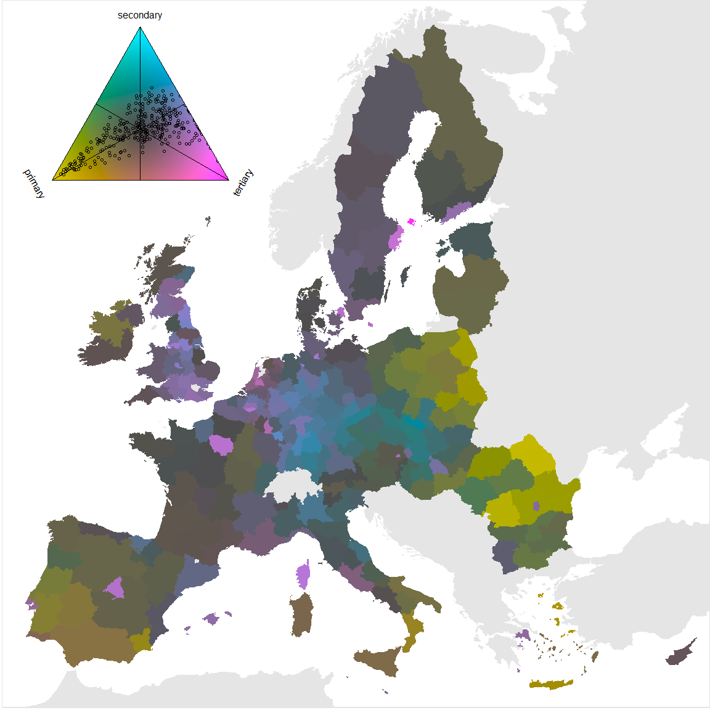
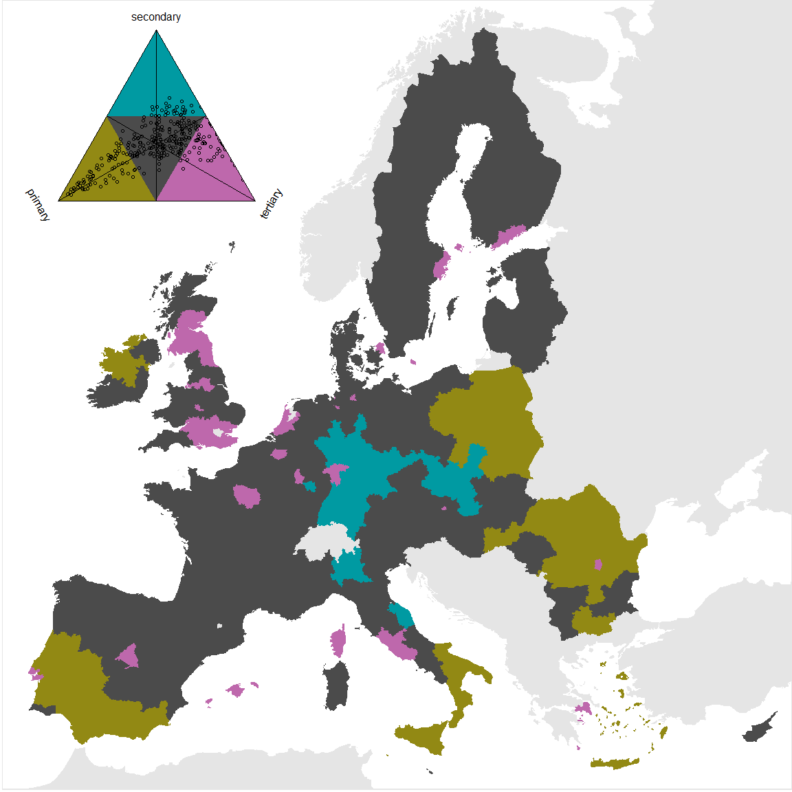

Tricolore. A Balanced Color Scale for Ternary Compositions
================
Jonas Schöley
2017-11-21

Install
-------

``` r
devtools::install_github('jschoeley/tricolore')
library(tricolore); DemoTricolore()
```

``` r
knitr::opts_chunk$set(warning=FALSE, message=FALSE, fig.width = 12, fig.height = 12)
library(tricolore)
library(dplyr)
```

Plotting raw proportions
------------------------

``` r
eu_sectors
```

    ## # A tibble: 318 x 4
    ##     nuts2     primary secondary  tertiary
    ##    <fctr>       <dbl>     <dbl>     <dbl>
    ##  1   AT11 0.044227886 0.2683658 0.6821589
    ##  2   AT12 0.056190950 0.2437842 0.6999005
    ##  3   AT13 0.005176357 0.1433731 0.8515710
    ##  4   AT21 0.056603774 0.2649211 0.6707740
    ##  5   AT22 0.060979730 0.2920608 0.6469595
    ##  6   AT31 0.062290240 0.3311854 0.6063901
    ##  7   AT32 0.041471331 0.2488280 0.7042914
    ##  8   AT33 0.039491121 0.2610655 0.6994434
    ##  9   AT34 0.022443890 0.3576060 0.5985037
    ## 10   BE10 0.000000000 0.1287062 0.8708446
    ## # ... with 308 more rows

``` r
# generate colors based on compositions and merge with map data
tricol <- MixColor(eu_sectors, primary, secondary, tertiary, legend = TRUE)
eu_sectors$srgb <- tricol$hexsrgb
map_data <- left_join(eushp_nuts2, eu_sectors, by = c('id' = 'nuts2'))

# plot ternary shaded choropleth map
europe_map +
  geom_polygon(aes(long, lat, group = group, fill = srgb),
               data = map_data) +
  scale_fill_identity() +
  annotation_custom(ggplotGrob(tricol$legend),
                    xmin = -7e5, xmax = 73e5,
                    ymin = 42e5, ymax = 55e5)
```


Plotting centered proportions
-----------------------------

``` r
# generate colors based on compositions and merge with map data
tricol <- MixColor(eu_sectors, primary, secondary, tertiary, center = TRUE, legend = TRUE)
eu_sectors$srgb <- tricol$hexsrgb
map_data <- left_join(eushp_nuts2, eu_sectors, by = c('id' = 'nuts2'))

# plot ternary shaded choropleth map
europe_map +
  geom_polygon(aes(long, lat, group = group, fill = srgb),
               data = map_data) +
  scale_fill_identity() +
  annotation_custom(ggplotGrob(tricol$legend),
                    xmin = -7e5, xmax = 73e5,
                    ymin = 42e5, ymax = 55e5)
```



Plotting discretized, centered proportions
------------------------------------------

``` r
# generate colors based on compositions and merge with map data
tricol <- MixColor(eu_sectors, primary, secondary, tertiary, center = TRUE,
                   k = 2, legend = TRUE)
eu_sectors$srgb <- tricol$hexsrgb
map_data <- dplyr::left_join(eushp_nuts2, eu_sectors, by = c('id' = 'nuts2'))

# plot ternary shaded choropleth map
europe_map +
  geom_polygon(aes(long, lat, group = group, fill = srgb),
               data = map_data) +
  scale_fill_identity() +
  annotation_custom(ggplotGrob(tricol$legend),
                    xmin = -7e5, xmax = 73e5,
                    ymin = 42e5, ymax = 55e5)
```


