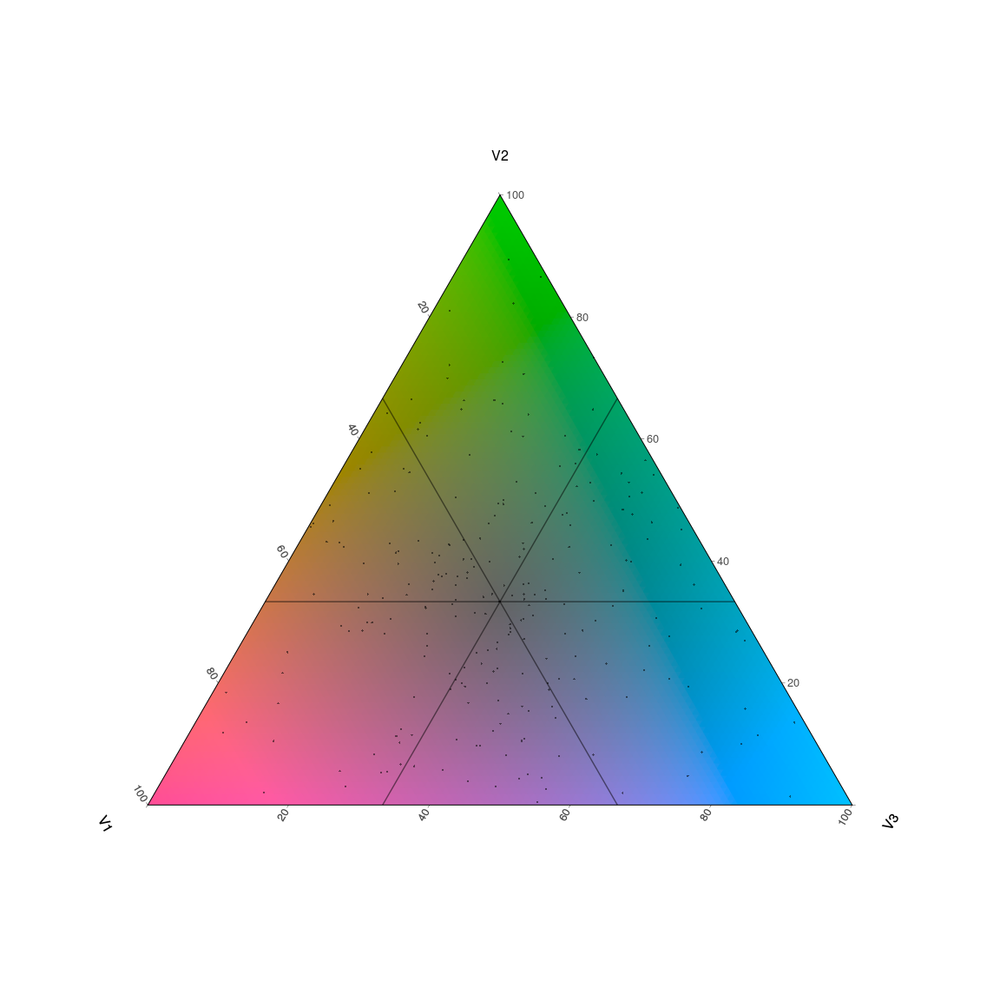
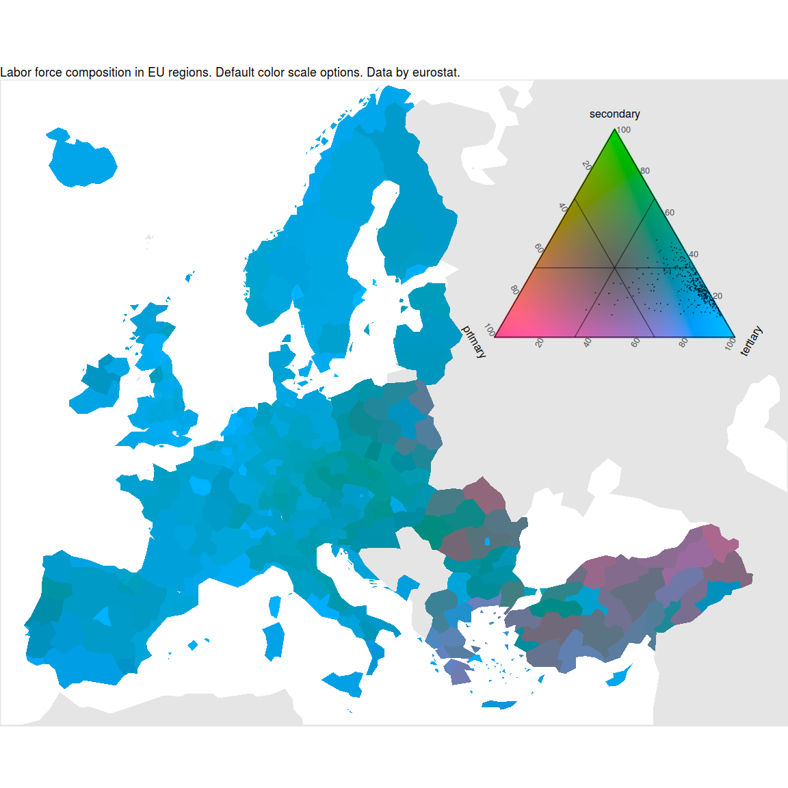
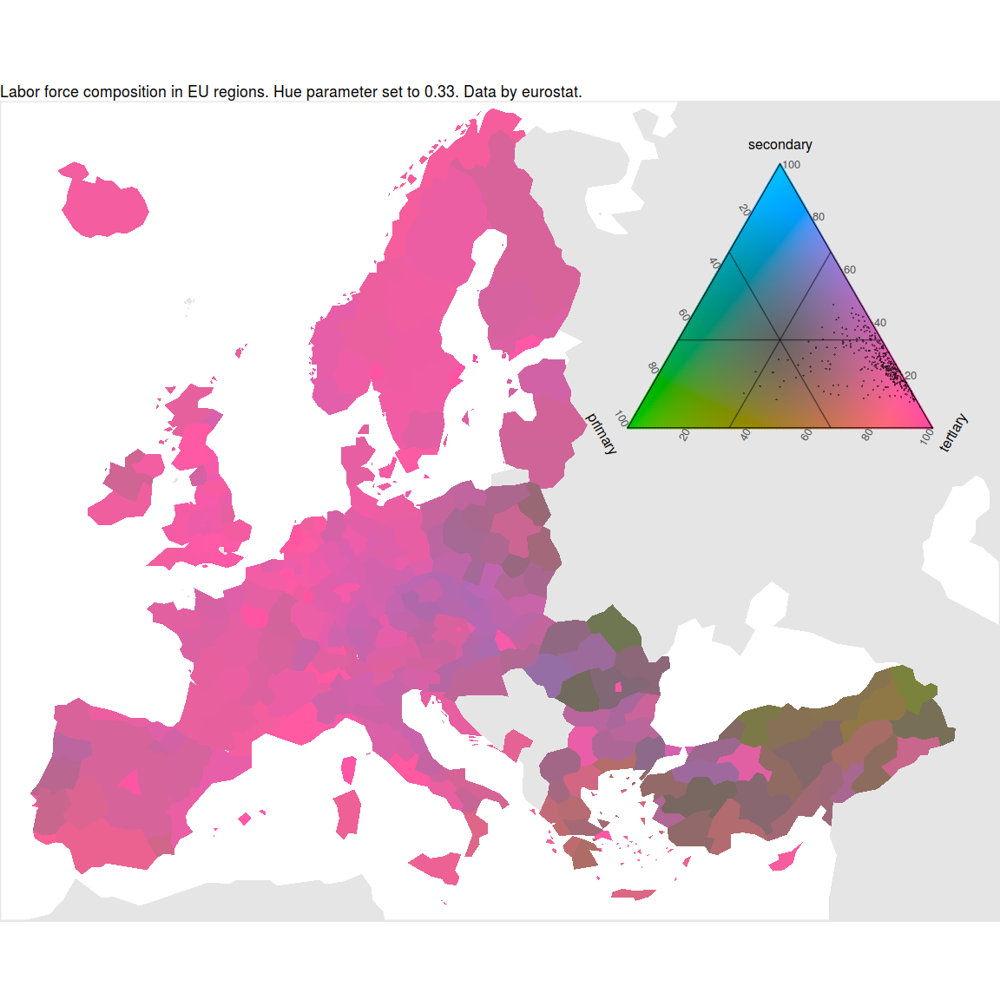
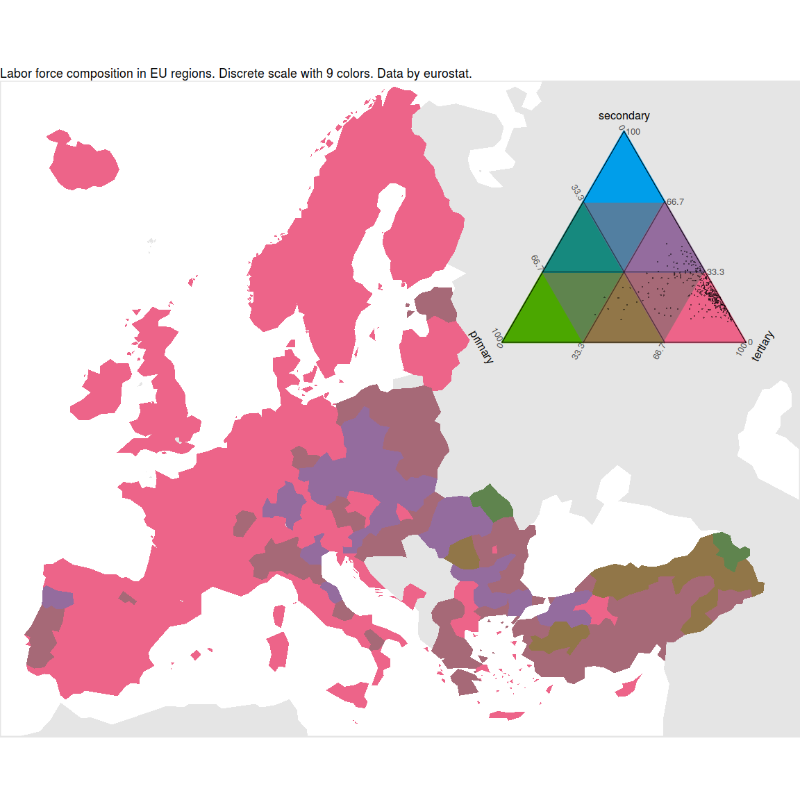
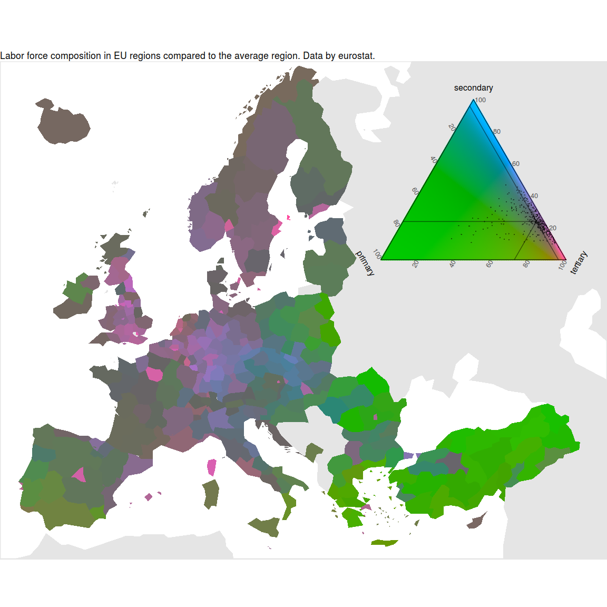

Tricolore. A flexible color scale for ternary compositions
================
Jonas Schöley
Tue Feb 13 15:17:22 2018

-   [What is 'tricolore'?](#what-is-tricolore)
-   [Install](#install)
-   [Getting Started](#getting-started)
-   [Case study: European labor force composition.](#case-study-european-labor-force-composition.)

What is 'tricolore'?
--------------------

Tricolore is a flexible color scale for three-part (ternary) compositions allowing you to color code any ternary composition and draw a corresponding color key. Tricolore flexibly adapts to many different visualization challenges via

-   discrete and continuous colors
-   support for unbalanced compositional data or data with very narrow range via centering and scaling of the color scale
-   hue, chroma and lightness options


Install
-------

``` r
devtools::install_github('jschoeley/tricolore')
library(tricolore); DemoTricolore()
```

Getting Started
---------------

The `Tricolore()` function takes a data-frame of three-part compositions, color-codes them and returns a list with elements `hexsrgb` and `legend`. The first list element is a vector of rgb codes for the color-coded compositions, the latter element gives a plot of the color key.

Here's a minimal example using simulated data.

``` r
library(ggtern)
library(tricolore)

# simulate 243 ternary compositions
P <- as.data.frame(prop.table(matrix(runif(3^6), ncol = 3), 1))
# color-code each composition and return a corresponding color key
tric <- Tricolore(P, 'V1', 'V2', 'V3')
# the color-coded compositions
head(tric$hexsrgb)
```

    ## [1] "#769100FF" "#4489BDFF" "#74656EFF" "#AD6BB3FF" "#706566FF" "#A96899FF"

``` r
tric$legend
```



*A ternary color key with the color-coded compositional data visible as points.*

You can familiarize yourself with the various options of `tricolore` by running `DemoTricolore()`.

Case study: European labor force composition.
---------------------------------------------

We are interested in the regional distribution of labor force by sector in the European Union. The `euro_sectors` data contains the share of workers in the three sectors for the year 2016 by NUTS-2 region.

``` r
euro_sectors <- subset(euro_sectors, year == 2016)
head(euro_sectors)
```

    ## # A tibble: 6 x 5
    ##    year id    primary secondary tertiary
    ##   <int> <chr>   <dbl>     <dbl>    <dbl>
    ## 1  2016 AT11  0.0442      0.268    0.682
    ## 2  2016 AT12  0.0562      0.244    0.700
    ## 3  2016 AT13  0.00518     0.143    0.852
    ## 4  2016 AT21  0.0566      0.265    0.671
    ## 5  2016 AT22  0.0610      0.292    0.647
    ## 6  2016 AT31  0.0623      0.331    0.606

In order to prepare a map I've prepared a data frame with the outlines of the European NUTS-2 regions and neighbouring countries, `euro_geo_nuts2`.

``` r
head(euro_geo_nuts2)
```

    ##      long     lat order  hole piece   id  group
    ## 1 4786948 2658725     1 FALSE     1 AT11 AT11.1
    ## 2 4778299 2654263     2 FALSE     1 AT11 AT11.1
    ## 3 4786401 2720388     3 FALSE     1 AT11 AT11.1
    ## 4 4805178 2780047     4 FALSE     1 AT11 AT11.1
    ## 5 4846490 2803511     5 FALSE     1 AT11 AT11.1
    ## 6 4854633 2791782     6 FALSE     1 AT11 AT11.1

Using tricolore, I color-code each regions labor force composition and merge the resulting vector of hexsrgb color codes with the map data.

``` r
# generate colors based on compositions in `euro_sectors`, default options
tricol <- Tricolore(euro_sectors, 'primary', 'secondary', 'tertiary')

# merge vector of colors with with map data
euro_sectors$srgb <- tricol$hexsrgb
map_data <- dplyr::left_join(euro_geo_nuts2, euro_sectors, by = 'id')
```

I use `ggplot2` to plot a map of Europe with each NUTS-2 region shaded according to its corresponding hexsrgb values (`scale_fill_identity()`). I merge the color-key returned by `tricolore` with the map using the `annotation_custom()` function.

``` r
euro_basemap +
  geom_polygon(aes(long, lat, group = group, fill = srgb),
               data = map_data) +
  scale_fill_identity() +
  annotation_custom(
    ggplotGrob(
      tricol$legend +
        theme(plot.background = element_rect(fill = NA, color = NA))
    ),
    xmin = 53e5, xmax = Inf, ymin = 35e5, ymax = Inf)
```



*Labor force composition in EU regions. Default color scale options. Data by eurostat.*

Europe's labor force predominantly works in the tertiary sector, as seen by a map colored in various shades of blue. Reddish and greenish hues in eastern Europe indicate a higher share of primary and secondary labor force respectively.

I'm not happy with the basic colors used to represent primary, secondary, and tertiary sectors. I think its much more natural to encode the primary (agricultural) sector in green, the secondary (industrial) sector in blue and the tertiary (services) sector in red. This is easily achieved by changing *hue* parameter of the color scale.

``` r
tricol <- Tricolore(euro_sectors, 'primary', 'secondary', 'tertiary', hue = 0.33)
```

*In the examples to follow I omit the whole mapping code. It is identical for all examples.*



*Labor force composition in EU regions. Hue parameter set to 0.33. Data by eurostat.*

Up until now I used continuous colors to show the regional labor force composition. A discrete color scale introduces sharp contours which sometimes pronounce interesting patterns in the data. The `breaks` parameter determines the number of colors for the color scale. A value of 3 gives a discrete scale of 3^2=9 colors. The discrete scale pronounces the east-west divide in labor force composition.

``` r
tricol <- Tricolore(euro_sectors, 'primary', 'secondary', 'tertiary', hue = 0.33, breaks = 3)
```



*Labor force composition in EU regions. Discrete scale with 9 colors. Data by eurostat.*

A technique I've adopted from compositional data analysis is *ternary centering*. Centering shifts the center of the color scale (the greypoint) to the center of the data and thereby shows deviations from the average composition. It's the ternary equivalent to a divergent color-scale with the average value at the midpoint.

Centering the color scale over the labor-force composition of the average European NUTS-2 region shows various patterns of deviations from the average. Metropolitan regions (Hamburg, Stockholm, Paris, Madrid) have a higher than average share of tertiary workers. Large parts of France are quite grey, indicating a labor-force composition close to the average, while Eastern Europe, the south of Spain and Italy have a higher than average share of workers active in the primary sector.

``` r
tricol <- Tricolore(euro_sectors, 'primary', 'secondary', 'tertiary',
                    hue = 0.33, center = NA)
```


